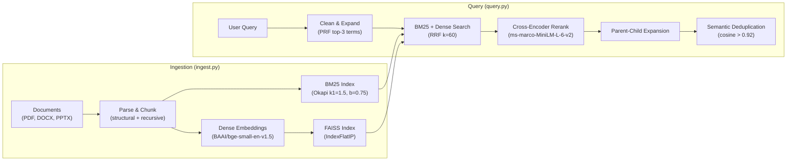

# rag-basic-local

A simple, fully offline Retrieval-Augmented Generation (RAG) pipeline for local use. It parses technical documents (PDF, DOCX, PPTX, etc.), chunks them intelligently, builds a BM25 sparse index and dense FAISS embeddings, and queries them with a hybrid retrieval pipeline.

## Features

### Ingestion Pipeline (`ingest.py`)
- **Multi-format parsing** — supports PDF, DOCX, PPTX, and more via lightweight offline parsers.
- **Hybrid chunking** — combines structural boundaries with overlapping windows to preserve context.
- **BM25 index** — builds an inverted index with pre-computed IDF tables, 100% offline.
- **Dense embeddings** — encodes chunks with `BAAI/bge-small-en-v1.5` for semantic search.
- **Incremental caching** — SHA-256 fingerprints skip unchanged documents on re-runs, stored in a sidecar cache.

### Query Pipeline (`query.py`)
- **Hybrid retrieval** — fuses BM25 keyword scores and dense embedding cosine similarity via Reciprocal Rank Fusion (RRF).
- **Cross-encoder reranking** — re-scores top candidates with `cross-encoder/ms-marco-MiniLM-L-6-v2` for better relevance.
- **Parent-child expansion** — pulls in surrounding context for headings and structural elements.
- **Pseudo-relevance feedback (PRF)** — automatically expands queries with distinctive terms from top initial results.
- **MMR diversity** — optional Maximal Marginal Relevance to balance similarity and result diversity.
- **Semantic deduplication** — removes near-duplicate chunks before returning results.

## Workflow Overview



## Project Structure

```
rag-basic-local/
├── ingest.py              # Offline document ingestion and indexing
├── query.py                 # Hybrid BM25 + dense search and reranking
├── requirements.txt         # Python dependencies
├── SKILL.md                 # Agent skill definition for VS Code Copilot
└── QUERY_WORKFLOW.md        # Detailed query workflow documentation
```

## Environment Setup

The pipeline requires a single environment variable pointing to your workspace directory. This directory should contain:
- `in/` — folder with source documents to ingest
- `out/` — folder where index and embedding files are written

### Setting `RAG_PATH`

#### Windows (PowerShell)
```powershell
$env:RAG_PATH = "C:\Users\YourName\Documents\rag-workspace"
```

#### Windows (Command Prompt)
```cmd
set RAG_PATH=C:\Users\YourName\Documents\rag-workspace
```

#### Linux / macOS
```bash
export RAG_PATH="/home/username/rag-workspace"
```

## Usage

### 1. Ingest Documents

```bash
# Default: read from ./in, write to ./out/rag_output.json
python ingest.py

# Custom paths and options
python ingest.py /path/to/documents --output /path/to/output.json --chunk-threshold 768 --overlap-ratio 0.15 --force
```

### 2. Query the Index

```bash
# Basic BM25 query
python query.py "search terms"

# Full hybrid pipeline with all features
python query.py "compressor shock waves" --json --mode hybrid --rerank --parent-child --prf --top-k 10
```

## AI Assistant Integration

Copy `rag-query/SKILL.md` into your assistant's skills/prompts folder so it can invoke the query pipeline automatically.

| Assistant | Skills / Prompts Folder |
|-----------|-------------------------|
| VS Code Copilot | `.github/skills/rag-query/SKILL.md` (workspace only) |
| OpenCode | `~/.config/opencode/skills/` (global) or `.opencode/skills/` (repo) |
| Claude Code | `~/.claude/skills/` (global) or `.claude/skills/` (repo) |
| Continue.dev | `~/.continue/` (global) or `.continue/` (repo) |
| Custom agents | Any skill/prompt folder your agent reads from |

### General Requirements for All Agents

- `RAG_PATH` must be set so the agent can locate `out/rag_output.json` and `out/rag_embeddings.faiss`.
- The agent should clean user queries (strip filler words) before passing them to `query.py`.
- The agent should synthesize answers with inline citations like `[source_document, pg. page_range]`.

## Dependencies

Install all requirements (preferably in a virtual environment):

```bash
pip install -r requirements.txt
```

Key dependencies:
- `sentence-transformers` — embedding and cross-encoder models
- `faiss-cpu` — dense vector similarity search
- `pymupdf`, `python-docx`, `python-pptx` — document parsing
- `numpy` — numerical operations

## License

See `LICENSE` file for details.
