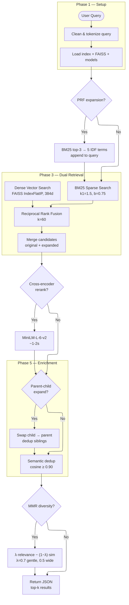

# RAG Query Workflow

End-to-end hybrid retrieval pipeline with cross-encoder reranking, parent-child expansion, semantic deduplication, and optional MMR diversity.

Triggered via the `rag-query` skill: `python query.py "search terms" --json --mode hybrid --rerank --parent-child --prf --top-k 10`



---

## Stage Details

### 0. Initialization

| Component | Data loaded |
|---|---|
| `rag_output.json` | Chunks + inverted index + IDF map + doc length stats |
| `rag_embeddings.faiss` | Pre-built FAISS inner-product index (lazy, on first use) |
| `rag_chunk_ids.json` | Ordered chunk IDs matching FAISS row indices |
| `bge-small-en-v1.5` | Bi-encoder (384d), loaded once via `SentenceTransformer(local_files_only=True)` |
| `cross-encoder/ms-marco-MiniLM-L-6-v2` | Cross-encoder (22M), loaded once via `CrossEncoder(local_files_only=True)` |

### 1. PRF Query Expansion (`--prf`)

| Step | Description |
|---|---|
| First-pass BM25 | Run BM25 on the **original** query only, fetch top 3 chunks |
| Extract expansion terms | From those 3 chunks, select the 5 terms with highest combined IDF score, excluding terms already in the query |
| Append expanded query | `"original question" + " " + expansion_terms` → two queries total |

### 2. Dual Retrieval

Two independent searches run per query variant:

**BM25 (Sparse)**
```
score(chunk) = Σ IDF(token) × tf_norm
tf_norm = TF × (k1+1) / (TF + k1 × (1-b + b × dl/avgdl))
```
- k1 = 1.5, b = 0.75
- Whitelist: tokens must pass stopword removal, min 2 chars, punctuation stripped
- Excludes heading-only noise, parent blocks, filter mismatches
- Fetch: `top_k × 3` (= 30 for top_k=10)

**Dense (FAISS)**
- Encode query → 384d vector, L2-normalized
- `IndexFlatIP` search (inner product = cosine similarity after normalization)
- Fetch: `top_k × 9` (= 90), or `top_k × 30` if filters active

### 3. Reciprocal Rank Fusion

```
RRF_Score(c) = 1/(60 + rank_bm25(c)) + 1/(60 + rank_dense(c))
```
- Chunks appearing in both lists get a boost (dual agreement)
- Chunks in only one list receive partial credit from that list
- Returns **150 candidates** (top_k × 15)

### 4. Cross-Encoder Reranking (`--rerank`)

| Aspect | Detail |
|---|---|
| Model | `cross-encoder/ms-marco-MiniLM-L-6-v2` (22M params) |
| Input pairs | (original clean query, full chunk text) |
| Scoring | Full joint encoding — the model reads both together |
| Candidate pool | 150 chunks |
| Runtime | ~1-2s |
| Fallback | If model not cached: silently skip, keep RRF scores, output `"reranked": false` |

### 5. Parent-Child Expansion (`--parent-child`)

Child chunks (produced by overlap/recursive splitting during ingestion) carry a `parent_id` pointing to their containing block.

| Action | Effect |
|---|---|
| Swap text | Replace child's snippet with parent's full paragraph/section |
| Deduplicate | If two children share the same parent, only keep the first occurrence |
| Benefit | The LLM receives complete context instead of sentence fragments |

### 6. Semantic Deduplication (Default)

Before returning results, near-duplicate chunks are removed using FAISS embedding cosine similarity:

```
kept = []
for each candidate (descending by score):
    if max(cosine_sim(candidate, kept)) < 0.90:
        kept.append(candidate)
```

- **Similarity**: cosine on FAISS embeddings (bge-small-en-v1.5, 384d)
- **Threshold**: 0.90 — catches true duplicates (same content, different format), keeps genuinely different content on the same page
- **Fallback**: if FAISS unavailable, returns top_k as-is
- **Never promotes off-topic content** — only removes redundancy

### 7. MMR Diversity (`--mmr-lambda N` — Opt-In)

Maximal Marginal Relevance is **opt-in only**. Pass `--mmr-lambda 0.5` when the user explicitly asks for maximum content diversity.

```
MMR(chunk) = λ × relevance − (1 − λ) × max(cosine_sim(chunk, already_selected))
```

- **Scores are min-max normalized to [0,1]** so λ is meaningful regardless of score distribution
- **Similarity**: cosine on FAISS embeddings (semantic, not lexical)
- **Iterative selection**: first pick = highest scored; each subsequent pick balances relevance vs. dissimilarity to already-chosen results
- **Risk**: lower λ values can promote off-topic chunks that happen to be semantically different
- **Guidance**: λ=0.7 for gentle diversity, λ=0.5 for aggressive spread across sources

### 8. Output

```json
{
  "reranked": true,
  "results": [
    {
      "score": 4.215,
      "hybrid_score": 0.029,
      "chunk_id": "uuid",
      "text": "[Aircraft Propulsion Farokhi 2ed.pdf]\n4.3 Aircraft Gas Turbine Engines\n...",
      "element_type": "text",
      "parent_heading": "4.3 Aircraft Gas Turbine Engines",
      "document_hierarchy_level": 3,
      "parent_id": "uuid | null",
      "source_document": "Aircraft Propulsion Farokhi 2ed.pdf",
      "page_range": "205-206",
      "token_count": 507,
      "reranked": true,
      "file_path": "C:\\Users\\...\\RAG\\in\\Aircraft Propulsion Farokhi 2ed.pdf"
    }
  ]
}
```
